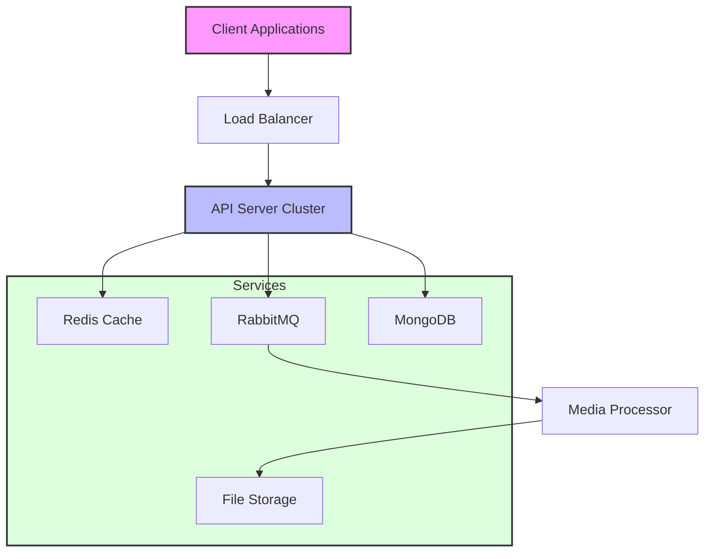
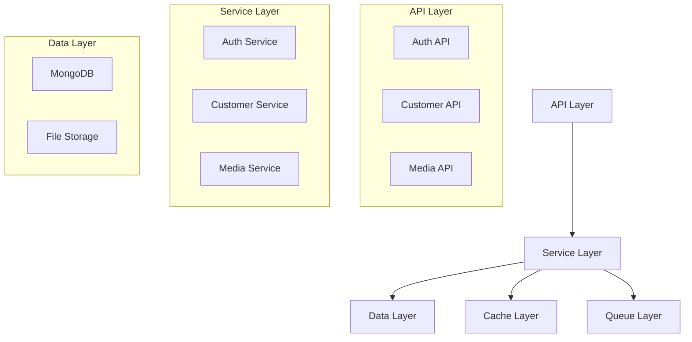
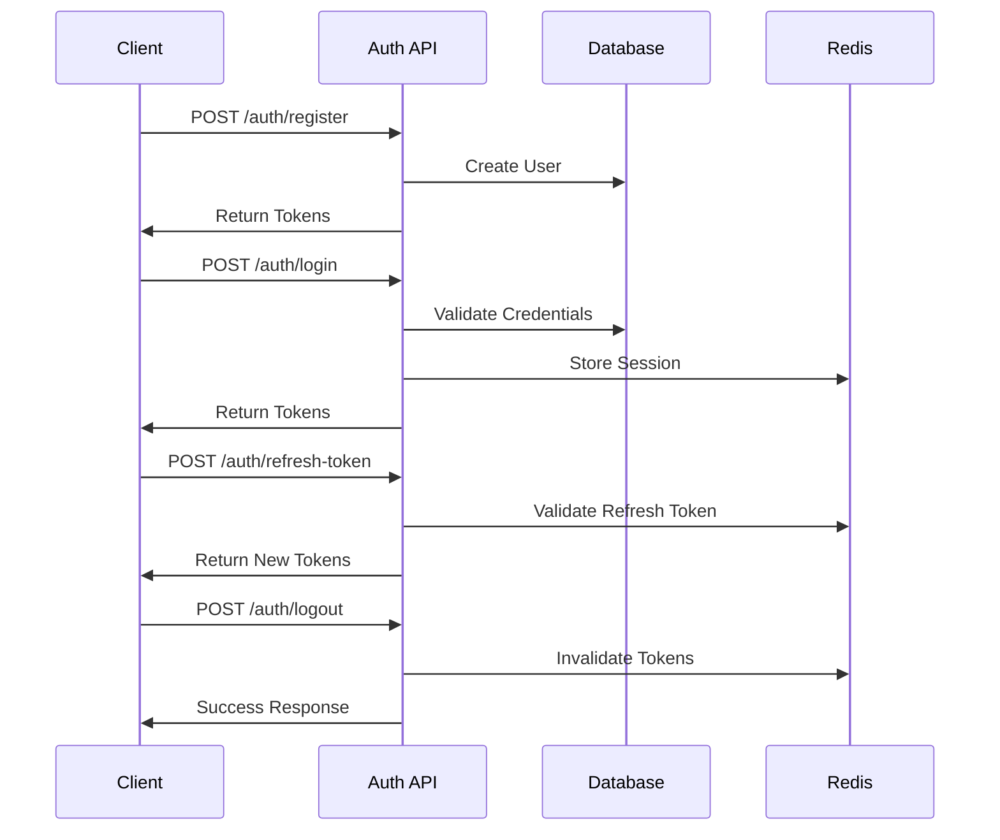
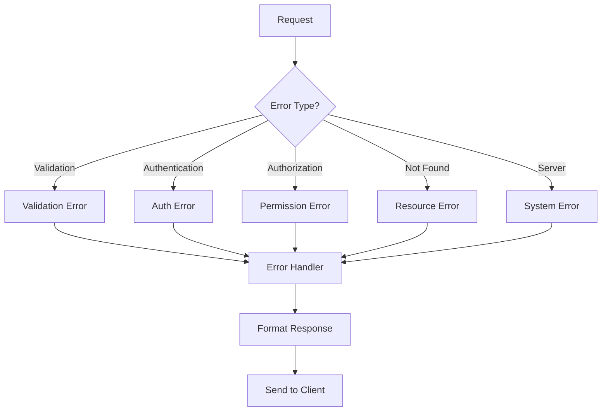

# Customer Management System

A robust and scalable customer management system built with Node.js, TypeScript, and MongoDB. This system provides comprehensive customer data management, custom fields, media handling, and advanced analytics capabilities.

## Architecture Overview



## Features

- 🔒 **Authentication & Authorization**

  - JWT-based authentication
  - Role-based access control
  - Multi-device session management
  - Secure token refresh mechanism

- 👥 **Customer Management**

  - CRUD operations
  - Custom fields support
  - Batch operations
  - Group management
  - Tags and metadata

- 📊 **Custom Fields**

  - Dynamic field definitions
  - Multiple field types (text, number, date, boolean, list)
  - Validation rules
  - Default values

- 📁 **Media Management**

  - Secure file uploads
  - Multiple file types support
  - WhatsApp integration
  - Async processing
  - Storage management

- 📈 **Analytics & Reporting**
  - Customer statistics
  - Usage analytics
  - Custom reports
  - Data exports

## System Components



## Prerequisites

- Node.js >= 20.0.0
- MongoDB >= 6.0
- Redis >= 6.0
- RabbitMQ >= 3.8
- TypeScript >= 5.0

## Installation

1. Clone the repository:

```bash
git clone https://github.com/yourusername/customer-management.git
cd customer-management
```

2. Install dependencies:

```bash
pnpm install
```

3. Create environment file:

```bash
cp .env.example .env
```

4. Configure environment variables:

```env
# Server
NODE_ENV=development
PORT=4000
API_VERSION=v1
ALLOWED_ORIGINS=http://localhost:3000

# Database
MONGODB_URI=mongodb://localhost:27017/your-database
MONGODB_POOL_SIZE=10

# Redis
REDIS_URL=redis://localhost:6379
REDIS_PASSWORD=

# RabbitMQ
RABBITMQ_URL=amqp://localhost
RABBITMQ_QUEUE_PREFIX=app

# JWT
JWT_SECRET=your-jwt-secret
JWT_REFRESH_SECRET=your-jwt-refresh-secret
JWT_EXPIRES_IN=15m
JWT_REFRESH_EXPIRES_IN=7d

# Rate Limiting
RATE_LIMIT_WINDOW=900000
RATE_LIMIT_MAX_REQUESTS=100

# Server Configuration
MAX_WORKERS=0
SHUTDOWN_TIMEOUT=30000
HEALTH_CHECK_INTERVAL=30000
HEALTH_CHECK_TIMEOUT=5000
```

5. Run database migrations:

```bash
pnpm migrate
```

6. Start development server:

```bash
pnpm dev
```

## Project Structure

```
src/
├── config/             # Configuration files
├── controllers/        # Route controllers
├── middleware/        # Express middleware
├── models/            # Mongoose models
├── routes/            # API routes
├── services/          # Business logic
├── types/             # TypeScript type definitions
├── utils/             # Utility functions
├── app.ts             # Express app setup
└── server.ts          # Server entry point
```

## API Documentation

### Auth Flow



### API Routes

Base URL: `/api/v1`

#### Authentication

- POST `/auth/register` - Register new user
- POST `/auth/login` - User login
- POST `/auth/refresh-token` - Refresh access token
- POST `/auth/logout` - User logout

#### Customers

- GET `/customers` - List customers
- POST `/customers` - Create customer
- GET `/customers/:id` - Get customer by ID
- PUT `/customers/:id` - Update customer
- DELETE `/customers/:id` - Delete customer
- PATCH `/customers/batch` - Batch update customers

#### Custom Fields

- GET `/customers/fields` - List custom fields
- POST `/customers/fields` - Create custom field
- GET `/customers/fields/:id` - Get custom field
- PUT `/customers/fields/:id` - Update custom field
- DELETE `/customers/fields/:id` - Delete custom field

#### Media Management

- POST `/media/upload` - Upload single file
- POST `/media/bulk-upload` - Upload multiple files
- GET `/media` - List media files
- GET `/media/:id` - Get media by ID
- DELETE `/media/:id` - Delete media

## Error Handling

The system uses a centralized error handling mechanism:



## Testing

```bash
# Run all tests
pnpm test

# Run tests in watch mode
pnpm test:watch

# Run tests with coverage
pnpm test:coverage

# Run specific test file
pnpm test:file path/to/test
```

## Performance Optimizations

1. **Caching Strategy**

   - Redis for session management
   - Query result caching
   - Rate limiting

2. **Database Optimizations**

   - Compound indexes
   - Lean queries
   - Batch operations

3. **Server Optimizations**
   - Cluster mode
   - Connection pooling
   - Compression

## Security Measures

- JWT-based authentication
- Rate limiting
- Input validation
- XSS protection
- CORS configuration
- Security headers
- File upload validation
- Request sanitization

## Contributing

1. Fork the repository
2. Create your feature branch (`git checkout -b feature/amazing-feature`)
3. Commit your changes (`git commit -m 'Add some amazing feature'`)
4. Push to the branch (`git push origin feature/amazing-feature`)
5. Open a Pull Request

## License

This project is licensed under the ISC License - see the [LICENSE](LICENSE) file for details.

## Support

For support, email karansxa@gmail.com or Whatsapp - +91 8910750026
