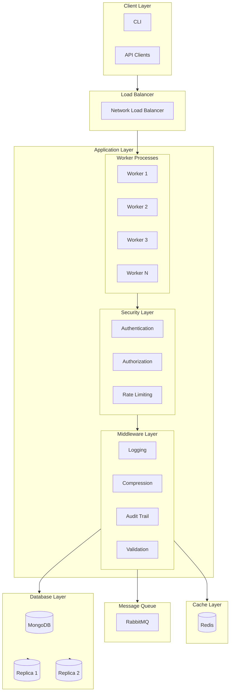

# High-Performance Node.js TypeScript Backend

A production-ready, high-performance backend service built with Node.js, TypeScript, and modern architectural patterns. This project implements industry best practices for security, scalability, and maintainability.

## 🏗️ Architecture



## 🌟 Features

### Performance Optimizations

- **Multi-Core Utilization**

  - Cluster mode for optimal CPU usage
  - Load balancing across worker processes
  - Zero-downtime reloads

- **Caching Strategy**

  - Redis for session management
  - Distributed caching
  - Cache invalidation patterns
  - Rate limiting data storage

- **Database Optimization**

  - Connection pooling
  - Indexed collections
  - Replica set support
  - Write concern optimization

- **Message Queue**
  - RabbitMQ for async operations
  - Dead letter queues
  - Message persistence
  - Priority queuing

### Security Features

- **Authentication & Authorization**

  - JWT with refresh tokens
  - Role-based access control (RBAC)
  - Permission-based authorization
  - Token blacklisting

- **API Security**

  - Rate limiting per IP/user
  - CORS protection
  - Helmet security headers
  - Request size limiting
  - Input validation & sanitization

- **Data Protection**
  - Password hashing with bcrypt
  - Audit logging
  - Data encryption
  - Secure session handling

### High Availability

- **Fault Tolerance**

  - Graceful error handling
  - Circuit breaker pattern
  - Automatic reconnection
  - Health check endpoints

- **Monitoring**
  - Comprehensive logging
  - Performance metrics
  - Error tracking
  - Audit trails

### Customer Management

- **Dynamic Schema Management**

  - Flexible customer data model
  - Custom field support
  - Field type validation
  - Schema versioning

- **Customer Operations**
  - CRUD operations
  - Role-based access
  - Audit logging
  - Input validation
  - Pagination and filtering

## 🚀 Quick Start

### Prerequisites

```bash
# Required versions
Node.js >= 20.0.0
pnpm >= 8.0.0
MongoDB >= 6.0
Redis >= 7.0
RabbitMQ >= 3.12
```

### Installation

```bash
# Clone repository
git clone https://github.com/yourusername/project-name.git

# Install dependencies
pnpm install

# Configure environment
cp .env.example .env

# Start development server
pnpm dev
```

### Environment Variables

```env
# Server
NODE_ENV=development
PORT=4000
API_VERSION=v1

# Database
MONGODB_URI=mongodb://localhost:27017/database
MONGODB_POOL_SIZE=10

# Redis
REDIS_URL=redis://localhost:6379
REDIS_PASSWORD=your-password

# RabbitMQ
RABBITMQ_URL=amqp://localhost
RABBITMQ_QUEUE_PREFIX=app

# Security
JWT_SECRET=your-secret-key
JWT_REFRESH_SECRET=your-refresh-secret
JWT_EXPIRES_IN=15m
JWT_REFRESH_EXPIRES_IN=7d

# Rate Limiting
RATE_LIMIT_WINDOW=15m
RATE_LIMIT_MAX_REQUESTS=100
```

## 📦 Project Structure

```
src/
├── config/         # Configuration & service initialization
├── controllers/    # Request handlers
├── middleware/     # Express middleware
├── models/         # Database models
├── routes/         # API routes
├── services/       # Business logic & external services
├── types/          # TypeScript type definitions
├── utils/          # Utility functions & helpers
├── app.ts         # Express application setup
└── server.ts      # Server entry point
```

## 🔧 Scripts

```bash
# Development
pnpm dev           # Start development server
pnpm build         # Build production bundle
pnpm start         # Start production server

# Quality Assurance
pnpm lint          # Run ESLint
pnpm format        # Format with Prettier
pnpm test          # Run tests
pnpm test:coverage # Generate coverage report

# Maintenance
pnpm clean         # Clean build artifacts
pnpm deps:update   # Update dependencies
```

## 📡 API Examples

### Customer Schema Management

```bash
# Get current schema
curl -X GET \
  'http://localhost:4000/api/v1/customers/schema' \
  -H 'Authorization: Bearer YOUR_ACCESS_TOKEN'

# Update schema
curl -X PUT \
  'http://localhost:4000/api/v1/customers/schema' \
  -H 'Authorization: Bearer YOUR_ACCESS_TOKEN' \
  -H 'Content-Type: application/json' \
  -d '{
    "fields": [
      {
        "name": "name",
        "type": "string",
        "required": true,
        "isDefault": true
      },
      {
        "name": "vehicleType",
        "type": "select",
        "required": true,
        "options": ["Bike", "Car", "Truck"]
      }
    ]
  }'
```

### Customer CRUD Operations

```bash
# Create customer
curl -X POST \
  'http://localhost:4000/api/v1/customers' \
  -H 'Authorization: Bearer YOUR_ACCESS_TOKEN' \
  -H 'Content-Type: application/json' \
  -d '{
    "name": "John Doe",
    "phoneNumber": {
      "countryCode": "+1",
      "number": "1234567890"
    },
    "assignedAdmin": "admin_id",
    "customFields": {
      "vehicleType": "Car"
    }
  }'

# Get customers with pagination
curl -X GET \
  'http://localhost:4000/api/v1/customers?page=1&limit=10' \
  -H 'Authorization: Bearer YOUR_ACCESS_TOKEN'
```

## 📈 Performance Benchmarks

| Operation         | Response Time | Throughput |
| ----------------- | ------------- | ---------- |
| Authentication    | < 100ms       | 1000 req/s |
| Database Query    | < 50ms        | 2000 req/s |
| Cache Operation   | < 10ms        | 5000 req/s |
| Message Queue     | < 30ms        | 4000 msg/s |
| Customer Creation | < 150ms       | 800 req/s  |
| Schema Update     | < 200ms       | 500 req/s  |

## 🔒 Security Practices

### Authentication Flow

1. User provides credentials
2. Server validates & issues JWT
3. Client stores tokens securely
4. Refresh token rotation
5. Token blacklisting on logout

### Data Protection

- All passwords hashed with bcrypt
- Sensitive data encrypted at rest
- HTTPS enforced in production
- Input validation on all routes
- XSS & CSRF protection

## 📊 Monitoring & Logging

### Log Levels

- ERROR: System errors & exceptions
- WARN: Warning conditions
- INFO: General information
- DEBUG: Detailed debugging
- AUDIT: Security events

### Metrics

- Request duration
- Error rates
- Cache hit ratio
- Queue depth
- CPU & memory usage
- Schema version changes
- Customer operation stats

## 🤝 Contributing

1. Fork the repository
2. Create feature branch (`git checkout -b feature/amazing-feature`)
3. Commit changes (`git commit -m 'Add amazing feature'`)
4. Push to branch (`git push origin feature/amazing-feature`)
5. Open a Pull Request

## 📄 License

This project is licensed under the ISC License - see the [LICENSE](LICENSE) file for details.
