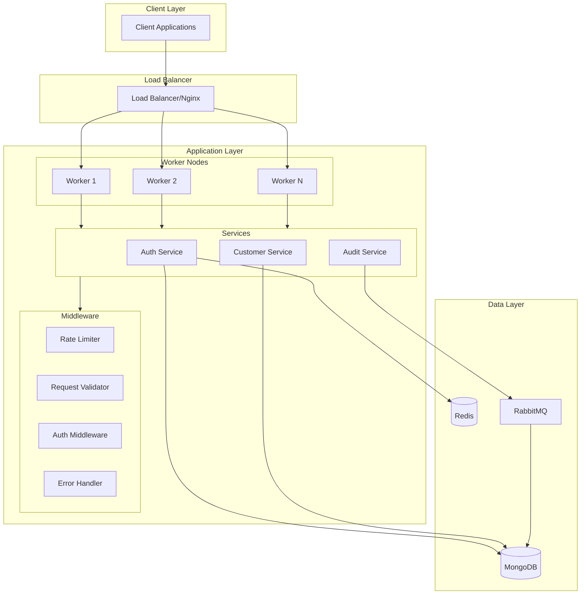
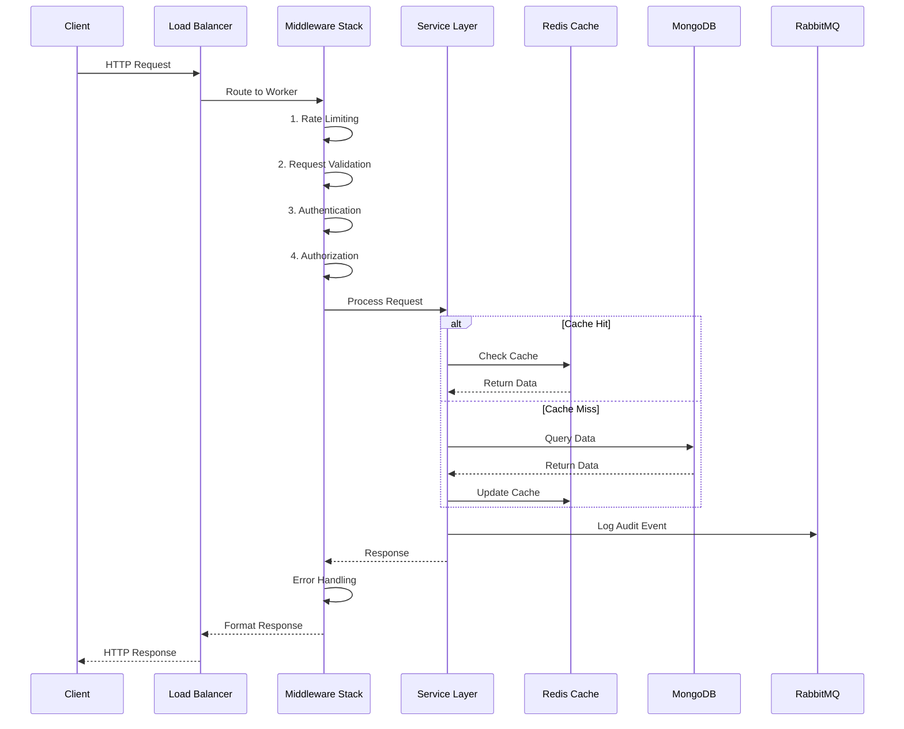

# Enterprise Node.js Backend

A highly scalable, secure, and maintainable Node.js backend built with TypeScript, featuring robust authentication, role-based access control, and comprehensive audit logging.

## 🏗 Architecture

### System Overview

### System Overview



Our system follows a microservices-inspired architecture with the following key components:

1. **Load Balancer Layer**

   - Nginx reverse proxy
   - SSL/TLS termination
   - Request distribution

2. **Application Layer**

   - Multiple worker nodes (cluster mode)
   - Service-oriented architecture
   - Middleware stack for security and performance

3. **Data Layer**
   - MongoDB for primary data storage
   - Redis for caching and rate limiting
   - RabbitMQ for async event processing

### Request Flow



Each request goes through multiple layers of processing:

1. **Load Balancing**

   - Request distribution across workers
   - Health checking
   - Basic DDoS protection

2. **Middleware Stack**

   - Rate limiting
   - Request validation
   - Authentication
   - Authorization
   - Audit logging
   - Error handling

3. **Service Layer**
   - Business logic processing
   - Data validation
   - Cache management
   - Event dispatching

## 🚀 Features

### Security

- JWT-based authentication with refresh tokens
- Permission-based access control
- Rate limiting
- Request validation
- XSS protection
- CORS configuration
- Helmet security headers
- Audit logging

### Performance

- Worker clustering for CPU utilization
- Redis caching
- Connection pooling
- Optimized MongoDB queries
- Efficient error handling
- Response compression

### Scalability

- Horizontally scalable architecture
- Stateless authentication
- Distributed caching
- Message queuing
- Database indexing
- Connection management

### Maintainability

- TypeScript for type safety
- Comprehensive error handling
- Detailed logging
- Code modularization
- Consistent coding style
- Extensive documentation

## 🛠 Technical Stack

### Core

- Node.js (>= 20.x)
- TypeScript
- Express.js

### Database & Caching

- MongoDB
- Redis
- RabbitMQ

### Authentication & Security

- JSON Web Tokens (JWT)
- bcrypt
- helmet
- cors

### Validation & Types

- Zod
- TypeScript types

### Monitoring & Logging

- Winston
- Morgan

### Development & Quality

- ESLint
- Prettier
- Vitest
- ts-node-dev

## 📦 Installation

```bash
# Install dependencies
pnpm install

# Set up environment variables
cp .env.example .env

# Run database migrations
pnpm migrate

# Start development server
pnpm dev

# Build for production
pnpm build

# Start production server
pnpm start
```

## 🔧 Configuration

The application is configured using environment variables. Key configurations:

```typescript
// Server
NODE_ENV=development
PORT=4000
API_VERSION=v1
ALLOWED_ORIGINS=*

// JWT Tokens
JWT_SECRET=your-secret-key
JWT_REFRESH_SECRET=your-refresh-secret
JWT_EXPIRES_IN=15m
JWT_REFRESH_EXPIRES_IN=7d

// Database
MONGODB_URI=mongodb://localhost:27017/your-database
MONGODB_POOL_SIZE=10

// Redis
REDIS_URL=redis://localhost:6379
REDIS_PASSWORD=

// RabbitMQ
RABBITMQ_URL=amqp://localhost
RABBITMQ_QUEUE_PREFIX=app

// Server Configuration
MAX_WORKERS=0 # 0 means use all available CPUs
SHUTDOWN_TIMEOUT=30000
HEALTH_CHECK_INTERVAL=30000
HEALTH_CHECK_TIMEOUT=5000

// Rate Limiting
RATE_LIMIT_WINDOW=900000 # 15 minutes in ms
RATE_LIMIT_MAX_REQUESTS=100
```

## 🔒 Security

### Authentication Flow

1. User login/register
2. JWT token generation
3. Token refresh mechanism
4. Permission validation
5. Rate limiting
6. Audit logging

### Permission System

- Granular permission control
- Resource-based permissions
- Hierarchical permission structure
- Admin role bypass

## 📈 Scaling Considerations

### Horizontal Scaling

- Stateless authentication
- Distributed caching
- Message queuing
- Connection pooling

### Vertical Scaling

- Worker clustering
- Memory optimization
- Connection management
- Query optimization

## 🧪 Testing

```bash
# Run tests
pnpm test

# Run tests with coverage
pnpm test:coverage
```

## 📝 API Documentation

### Authentication Endpoints

```typescript
// Auth Routes
POST / api / v1 / auth / register;
POST / api / v1 / auth / login;
POST / api / v1 / auth / refresh - token;
POST / api / v1 / auth / logout;

// Required permissions: none (public endpoints)
```

### Customer Endpoints

```typescript
// Customer Management
POST /api/v1/customers              // Permission: customers:create
GET /api/v1/customers/:id           // Permission: customers:read
PUT /api/v1/customers/:id           // Permission: customers:update
DELETE /api/v1/customers/:id        // Permission: customers:delete
GET /api/v1/customers/statistics    // Permission: customers:statistics
PATCH /api/v1/customers/batch      // Permission: customers:batch-update

// Customer Groups
POST /api/v1/customers/groups                    // Permission: customer-groups:create
PUT /api/v1/customers/groups/:id                 // Permission: customer-groups:update
DELETE /api/v1/customers/groups/:id              // Permission: customer-groups:delete
GET /api/v1/customers/groups/:id                 // Permission: customer-groups:read
GET /api/v1/customers/groups                     // Permission: customer-groups:read
POST /api/v1/customers/groups/:id/customers      // Permission: customer-groups:manage-members
DELETE /api/v1/customers/groups/:id/customers    // Permission: customer-groups:manage-members
```

## 🚥 Error Codes

```typescript
enum ErrorCode {
  // Authentication & Authorization (1xxx)
  UNAUTHORIZED = 1001,
  INVALID_CREDENTIALS = 1002,
  TOKEN_EXPIRED = 1003,
  TOKEN_INVALID = 1004,
  INSUFFICIENT_PERMISSIONS = 1005,
  ACCOUNT_LOCKED = 1006,

  // Input Validation (2xxx)
  VALIDATION_ERROR = 2001,
  INVALID_INPUT = 2002,
  MISSING_REQUIRED_FIELD = 2003,
  INVALID_FORMAT = 2004,

  // Resource Errors (3xxx)
  RESOURCE_NOT_FOUND = 3001,
  RESOURCE_ALREADY_EXISTS = 3002,
  RESOURCE_CONFLICT = 3003,
  RESOURCE_DELETED = 3004,

  // Database Errors (4xxx)
  DATABASE_ERROR = 4001,
  TRANSACTION_FAILED = 4002,
  QUERY_FAILED = 4003,
  CONNECTION_ERROR = 4004,

  // External Service Errors (5xxx)
  SERVICE_UNAVAILABLE = 5001,
  EXTERNAL_API_ERROR = 5002,
  TIMEOUT = 5003,
  RATE_LIMIT_EXCEEDED = 5004,
}
```

## 📊 Health Check Endpoint

```typescript
GET /health

Response:
{
  "status": "ok",
  "timestamp": "2024-03-23T10:00:00Z",
  "version": "1.0.0",
  "environment": "production",
  "memoryUsage": {
    "heapUsed": 67,
    "heapTotal": 128,
    "external": 12,
    "rss": 167
  },
  "uptime": 3600
}
```

## 🤝 Contributing

1. Fork the repository
2. Create your feature branch (`git checkout -b feature/AmazingFeature`)
3. Commit your changes (`git commit -m 'Add some AmazingFeature'`)
4. Push to the branch (`git push origin feature/AmazingFeature`)
5. Open a Pull Request

## 📄 License

This project is licensed under the ISC License.

## 👥 Authors

- **karansxa** - _Initial work_

## 🏭 Project Structure

```
src/
├── config/                 # Configuration files
│   ├── env.ts             # Environment variables
│   ├── database.ts        # Database configuration
│   ├── redis.ts           # Redis configuration
│   └── rabbit-mq.ts       # RabbitMQ configuration
├── controllers/           # Request handlers
│   ├── auth.controller.ts
│   └── customer.controller.ts
├── middleware/           # Express middleware
│   ├── auth.middleware.ts
│   ├── audit.middleware.ts
│   └── error-handler.ts
├── models/               # Database models
│   ├── user.model.ts
│   └── customer.model.ts
├── routes/              # API routes
│   ├── auth.routes.ts
│   └── customer.routes.ts
├── services/            # Business logic
│   ├── auth.service.ts
│   └── customer.service.ts
├── types/              # TypeScript type definitions
│   ├── auth.ts
│   └── customer.ts
├── utils/              # Utility functions
│   ├── logger.ts
│   └── error-service.ts
├── app.ts             # Express app setup
└── server.ts          # Server entry point
```
