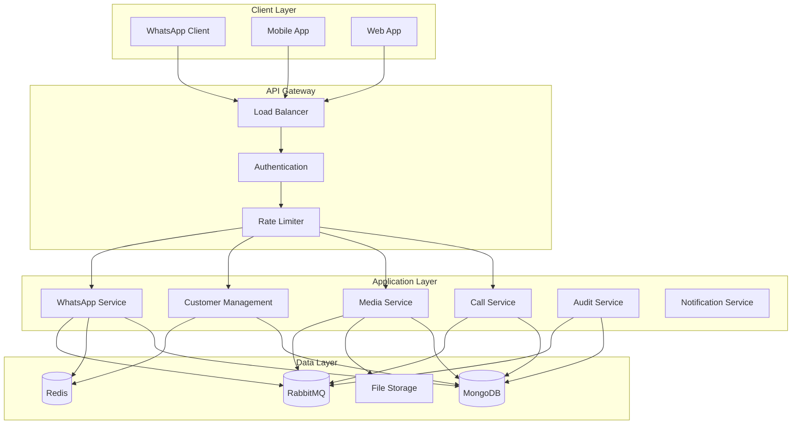
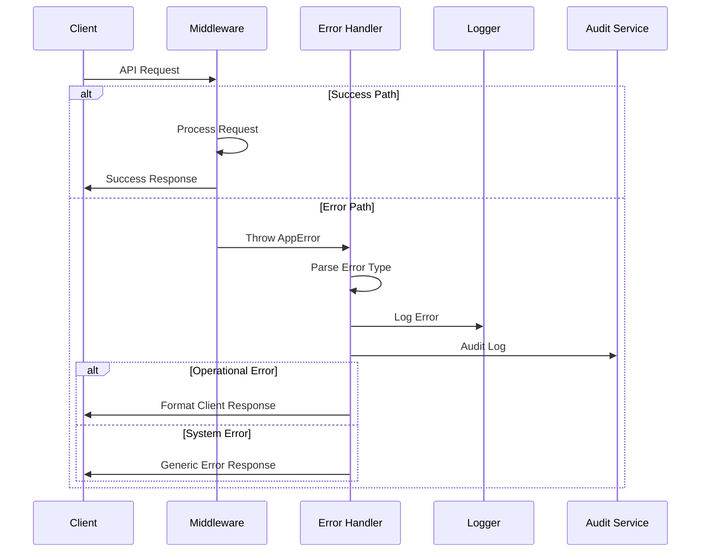
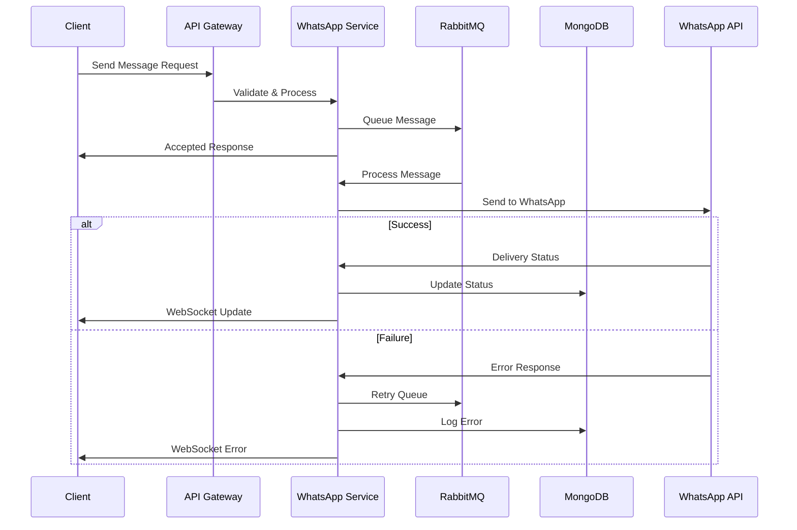
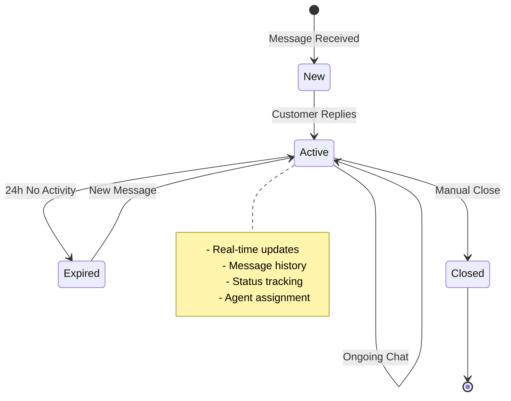
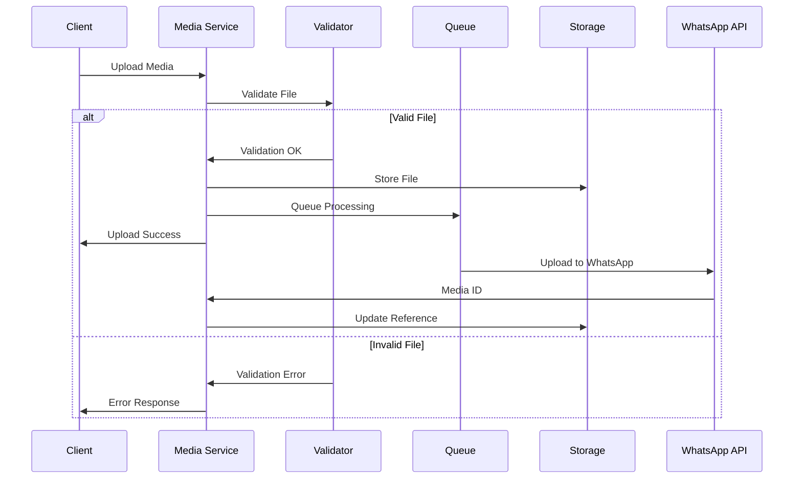

# Secure Enterprise Backend System

A high-performance, secure TypeScript-based backend system designed for enterprise messaging and customer management.

## System Architecture

### System Overview Diagram



### Error Handling Flow



### WhatsApp Message Flow



### Conversation Flow



### Media Upload Process



### Authentication Flow

````mermaid
flowchart TD
    A[Client Request] --> B{Has Token?}

    B -->|Yes| C{Verify Token}
    B -->|No| D[Return 401]

    C -->|Valid| E[Extract Claims]
    C -->|Invalid| F{Is Refresh?}

    F -->|Yes| G[Use Refresh Token]
    F -->|No| D

    G -->|Valid| H[Issue New Tokens]
    G -->|Invalid| D

    E --> I{Check Permissions}
    I -->|Has Access| J[Grant Access]
    I -->|No Access| K[Return 403]

    H --> E


### Core Features
- Secure authentication with JWT and refresh tokens
- Real-time messaging via Socket.IO with Redis adapter
- WhatsApp Business API integration
- Customer management system
- Media handling with secure upload validation
- Audit logging system
- Rate limiting and security measures
- Voice call integration with Exotel
- Scalable MongoDB database with connection pooling
- Message queuing with RabbitMQ
- Redis caching for performance optimization

### Technology Stack
- Node.js (>= 20.0.0)
- TypeScript 5.7+
- Express.js
- MongoDB with Mongoose
- Redis
- RabbitMQ
- Socket.IO
- Zod for validation
- JWT for authentication
- Multer for file uploads

### Architectural Patterns
- Singleton pattern for service instances
- Repository pattern for data access
- Observer pattern for event handling
- Factory pattern for object creation
- Middleware pattern for request processing

### Security Features
1. Authentication & Authorization
   - JWT with refresh tokens
   - Role-based access control (RBAC)
   - Permission-based access control
   - Token blacklisting
   - Secure session management

2. Request Security
   - Rate limiting
   - Input validation
   - CORS configuration
   - Helmet security headers
   - XSS protection
   - CSRF protection

3. Data Security
   - Data encryption
   - Password hashing with bcrypt
   - Secure file upload validation
   - Content type verification
   - File size limits

### Performance Optimizations
1. Caching Strategy
   - Redis caching for frequently accessed data
   - Cache invalidation patterns
   - Distributed caching support

2. Database Optimizations
   - Connection pooling
   - Indexed queries
   - Compound indexes
   - Lean queries for read operations

3. Message Queue System
   - RabbitMQ for asynchronous processing
   - Dead letter queues
   - Message persistence
   - Queue prioritization

### System Components

```mermaid
graph TB
    Client[Client Applications]
    AG[API Gateway]
    Auth[Auth Service]
    WA[WhatsApp Service]
    CM[Customer Management]
    MS[Media Service]
    Call[Call Service]
    Audit[Audit Service]

    DB[(MongoDB)]
    Cache[(Redis)]
    MQ[(RabbitMQ)]

    Client --> AG
    AG --> Auth
    AG --> WA
    AG --> CM
    AG --> MS
    AG --> Call

    Auth --> Cache
    Auth --> DB

    WA --> MQ
    WA --> Cache
    WA --> DB

    CM --> Cache
    CM --> DB

    MS --> MQ
    MS --> DB

    Call --> MQ
    Call --> DB

    subgraph Logging
        Audit --> DB
        Audit --> MQ
    end
````

## Setup and Installation

### Prerequisites

- Node.js >= 20.0.0
- pnpm
- MongoDB
- Redis
- RabbitMQ

### Installation Steps

1. Clone the repository

```bash
git clone <repository-url>
cd <project-directory>
```

2. Install dependencies

```bash
pnpm install
```

3. Set up environment variables

```bash
cp .env.example .env
```

Edit the .env file with your configuration

4. Build the project

```bash
pnpm build
```

5. Start the development server

```bash
pnpm dev
```

### Environment Configuration

Key environment variables that need to be configured:

```env
# Server
NODE_ENV=development
PORT=4000
API_VERSION=v1
ALLOWED_ORIGINS=*
API_BASE_URL=http://localhost:4000

# JWT
JWT_SECRET=your-secret-key
JWT_REFRESH_SECRET=your-refresh-secret
JWT_EXPIRES_IN=15m
JWT_REFRESH_EXPIRES_IN=7d

# Database
MONGODB_URI=mongodb://localhost:27017/your-database
MONGODB_POOL_SIZE=10

# Redis
REDIS_URL=redis://localhost:6379
REDIS_PASSWORD=

# RabbitMQ
RABBITMQ_URL=amqp://localhost
```

For all environment variables, refer to `src/config/env.ts`

## API Documentation

### Authentication Endpoints

- POST /api/auth/register - Register new user
- POST /api/auth/login - User login
- POST /api/auth/refresh-token - Refresh access token
- POST /api/auth/logout - User logout

### Customer Management

- POST /api/customers - Create customer
- GET /api/customers - List customers
- GET /api/customers/:id - Get customer details
- PUT /api/customers/:id - Update customer
- DELETE /api/customers/:id - Delete customer

### WhatsApp Integration

- POST /api/whatsapp/messages - Send message
- POST /api/whatsapp/messages/template - Send template message
- GET /api/whatsapp/conversations - List conversations
- POST /api/whatsapp/webhook - Webhook handler

### Media Handling

- POST /api/media/upload - Upload single file
- POST /api/media/bulk-upload - Upload multiple files
- GET /api/media/:id - Get media details
- DELETE /api/media/:id - Delete media

### Call Management

- POST /api/calls/initiate - Initiate call
- GET /api/calls/customer/:customerId - Get customer call history
- GET /api/calls/statistics - Get call statistics

## Testing

Run tests:

```bash
# Run all tests
pnpm test

# Run tests with coverage
pnpm test:coverage

# Run specific test file
pnpm test:file test/auth.test.ts
```

## Error Handling

The system uses a centralized error handling system with custom error classes:

```typescript
// Example error handling
try {
  // Operation that might fail
} catch (error) {
  throw new AppError(ErrorCode.VALIDATION_ERROR, 'Operation failed', 400, true, {
    details: { error },
  });
}
```

Error response format:

```json
{
  "status": "error",
  "message": "Error message",
  "code": "ERROR_CODE",
  "errors": [
    {
      "field": "fieldName",
      "message": "Validation message",
      "code": "VALIDATION_ERROR"
    }
  ]
}
```

## Security Considerations

1. Input Validation

   - All inputs are validated using Zod schemas
   - Sanitization of user inputs
   - File type validation
   - Size limits enforcement

2. Authentication

   - JWT token expiration
   - Refresh token rotation
   - Session management
   - Rate limiting

3. Data Protection
   - Password hashing
   - Sensitive data encryption
   - Secure file storage
   - Audit logging

## Performance Optimization

1. Caching Strategy

   - Redis caching for frequently accessed data
   - Cache invalidation on updates
   - Distributed caching support

2. Database Optimization

   - Indexed queries
   - Lean queries for read operations
   - Connection pooling
   - Query optimization

3. Message Queue
   - Asynchronous processing
   - Job prioritization
   - Error handling and retries
   - Dead letter queues

## Logging and Monitoring

The system uses Winston for logging with different log levels:

```typescript
logger.info('Operation successful');
logger.error('Operation failed:', error);
logger.warn('Warning message');
logger.debug('Debug information');
```

Log format:

```
YYYY-MM-DD HH:mm:ss:ms [LEVEL]: Message
```

## Contributing

1. Fork the repository
2. Create your feature branch
3. Commit your changes
4. Push to the branch
5. Create a new Pull Request

## License

This project is licensed under the ISC License.

## Support

For support, email support@example.com or join our Discord channel.
